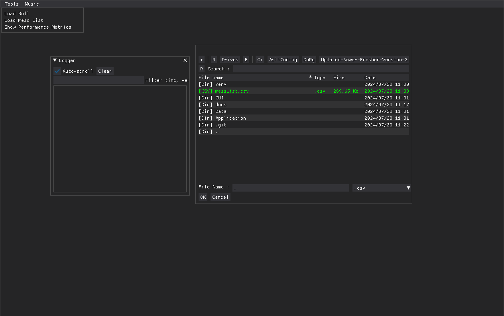
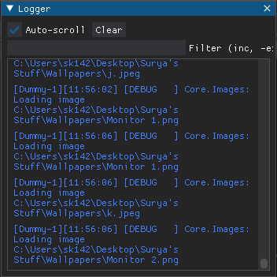

.. _Getting Started:

Getting Started
===============

This may seem somewhat complicated, but it's much easier than it may feel like, so let's dive in!

Loading The Mess List
---------------------

.. note::
   This needs to be done only when you have downloaded the app for the first time or when the mess list has changed.

The mess list is a csv file which consists of the ID Numbers, Names, Genders and Hostels of all the students in the college. You can keep it anywhere on your
PC. To load the mess list, drag the :ref:`Logger` window away to reveal the toolbar located on the top of the main app window. Simply click on Tools -> Load Mess List.
Any csv file will appear green. Simply select it. Upon succesful loading, a message will pop up, and za list will be loaded.

Loading The Roll
----------------

The roll is a folder containing all the images in one *DoPy Roll*. It will have a maximum of 40 images (tradition), and will have a suffix of *R*. Load the roll similarly
to the mess list (Tools->Load Roll). Choose the roll, and just click ok.

Billing Window
--------------

.. image :: Billing.webp
   :width: 800

Using this window, you can search for names, IDs, hostels, etc. and bill them accordingly. The billing window comes with a parser built into so you can querry the database of students with more control.
The parser syntax is confounding and stupefying at first, but like all things, when you break it down it becomes easier to grasp.

So, if you directly type out text, the billing window returns a bunch of names, regardless of hostel, year, etc. In order to search for a particular
**ID Number**, you need to enclose it in **forward slashes (/)** (for example, /0758/). For a particular **hostel**, you need to enlcose it in **square brackets ([])** (for example, [GN]).

.. list-table:: Hostel IDs
   :widths: 20 5
   :header-rows: 1

   * - Bhawan
     - Code
   * - Ashok
     - AK
   * - Budh
     - BD
   * - CV Raman
     - CVR
   * - Gandhi
     - GN
   * - Krishna
     - KR
   * - Malviya
     - ML
   * - Malviya Studio Apartments
     - MSA
   * - Meera
     - MR
   * - Ram
     - RM
   * - Rana Pratap
     - RP
   * - Shankar
     - SK
   * - Shrinivas Ramananujan (see the next entry)
     - SR
   * - Vishwakarma (no one calls it that)
     - VK
   * - Vyas
     - VY

Things get more interesting, though. something like /230758/ is a valid query. So is /0758/ and /A80720/ and /B4A3/, etc.
ID is basically represented in the form **([0-9]{2}|)([a-zA-Z][0-9]|)([a-zA-Z][0-9]|)([0-9]{4}|)** (for example, **22B4A30000**).
Therefore, /20230758/ doesnt work. Neither does a full ID like /2023AAPS0758P/.
Higher degree students (masters and phd) can be found by searching for **H[0-9] (masters) and PHXP (phd)**.

Also, when searching for names, no result will be displayed until three letters are typed out. When three letters are typed out, you get every single name
that contains those three letters. So, typing *ush* will give you *usha*, *kaushik* as well as *kushi*. After that every letter further typed gives a name with those letters in succession. (This is because we use SQLite's fts5 engine with the `trigram <https://www.sqlite.org/fts5.html>`_ tokeniser).

You can also use **& (AND/INTERSECTION)** and **| (OR/UNION)** with your queries. If you type surya | [GN], you get all the people who's name contains surya,
*OR* they live in gandhi. If you type surya & [GN], you get all the people who's name contains surya *AND* they live in gandhi. The evaluation goes from
left to right, and *unions are the outermost statement*, meaning *it will be evaluated with the least priority*. Brackets can also be added, which adds priority
(surya | [GN]) & /0758/ will evaluate the brackets first, and then move on.

As an example,
**ram & /b4/ & [GN]|[KR]** queries all the people with ram in their name *AND* have the b4 branch *AND* live in gandhi, *OR* the people living in krishna.
Basically it becomes **(ram & /b4/ & [GN])|([KR])**.

.. image :: Parser.webp
   :width: 800

.. _Logger:

Logger
------

The Logger, as the name implies, logs stuff! Nothing escapes its sight. You can filter out logs by typing into the text box. GUI.Music will show you only music related log messages and so on.

Music
-----

.. note::
   Although the internals for playing and visualising music are close to ready this feature is still unfinished. This will be implemented before BOSM.

In the same toolbar as the Tools option, the Music option exists. The DJ is spawned upon selection, and it has three options; start, change and stop.
Play the handpicked tunes lesgoo.

.. video:: DJ.webm
   :width: 600

Dinosaur
--------

.. image:: giraffe.jpg
  :width: 600
